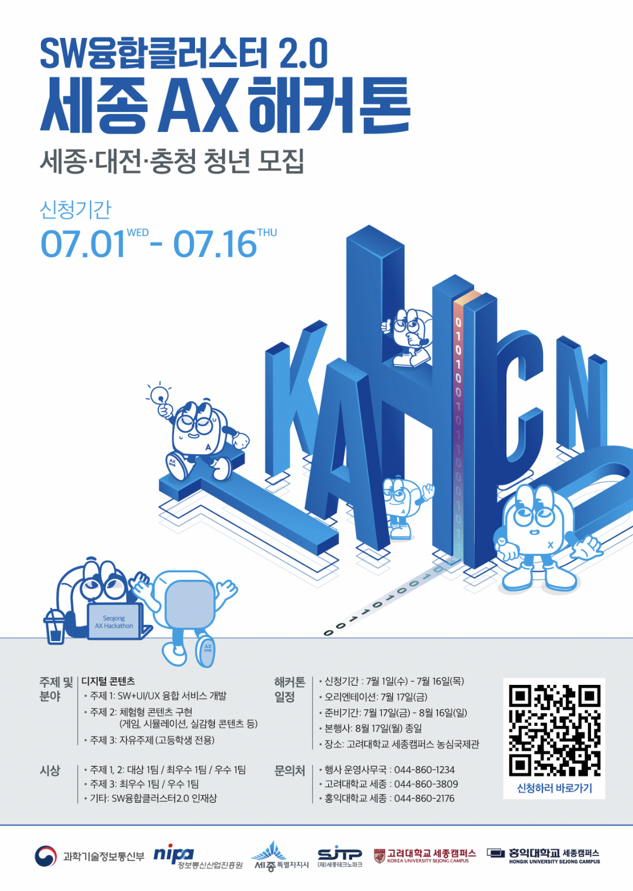

# cloSET

> 옷을 기억하고, 관리하고, 순환시키는 AI 디지털 옷장

cloSET은 사용자의 옷을 정적인 재고가 아니라 **등록 → 착용 → 세탁 → 보관 → 순환**으로 이어지는 상태 기반 자산으로 관리합니다. 목표는 옷을 더 많이 추천하는 것이 아니라, 이미 가진 옷을 더 잘 활용하고 실제 옷장 공백이 있을 때만 다음 선택을 제안하여 **덜 사고, 덜 버리고, 더 오래 입게 하는 것**입니다.



## 핵심 기능

- **MY CLOSET** — 사진과 구매내역으로 옷을 등록하고 위치·상태·착용 기록을 관리합니다.
- **오늘의 착장** — 날씨·TPO·퍼스널컬러·핏·최근 미착용 기간을 결합해 세 가지 조합을 제안합니다.
- **Care Label AI** — 케어라벨을 분석해 소재와 세탁 방법을 안내하고 세탁 상태를 관리합니다.
- **Smart Checker** — 구매 직전 보유 옷과 비교해 중복 위험과 예상 회당 비용을 보여줍니다.
- **Gap-to-Buy** — 기존 옷·세탁·보관·대여로 해결되지 않는 실제 옷장 공백에만 유사 상품을 추천합니다.
- **Re:Using** — 저착용 옷에 판매·기부·수선·업사이클 경로를 연결합니다.

## AI 설계 원칙

OpenAI GPT-4o API를 옷 사진·케어라벨·상품 이미지의 구조화 분석과 추천 이유 설명에 사용합니다. CPW, 중복 위험, 날씨·TPO·핏 점수, 탄소 산식과 BUY·STOP·ALTERNATIVE 판정은 결정적 코드가 담당합니다. API 키는 클라이언트에 포함하지 않고 서버 AI Gateway에서만 사용합니다.

## 인터랙티브 목업

`mockup/index.html`을 브라우저에서 열면 별도 설치 없이 동작합니다. 로그인·회원가입, 샘플 옷장 진입, 오늘의 착장, 옷장 검색·필터, Snap & Check, 케어, 순환, 지출·탄소, 설정과 로그아웃 흐름을 확인할 수 있습니다.

```bash
python3 -m http.server 8000 -d mockup
# http://localhost:8000
```

목업은 화면·흐름 검토용이며 실제 OpenAI API, OAuth, 이메일, 데이터베이스 또는 결제와 연결되지 않습니다.

## 문서

- [`docs/cloSET-IA-GPT4o-Auth.docx`](docs/cloSET-IA-GPT4o-Auth.docx) — GPT-4o API, Gap-to-Buy, 로그인·인증을 포함한 웹 제작용 초상세 IA
- [`docs/cloSET-IA-GPT4o-Auth.pdf`](docs/cloSET-IA-GPT4o-Auth.pdf) — 렌더링 검수용 PDF
- [`mockup/README.md`](mockup/README.md) — 목업 실행 및 편집 안내

## 상태

현재 저장소는 제품 기획·IA·인터랙티브 목업 단계입니다. 실제 서비스 구현 시 인증, 개인정보 동의, OpenAI 데이터 처리 설정, 상품 카탈로그, 가격·재고 갱신, 카본 계수 출처를 배포 환경에서 별도로 검증해야 합니다.

## 팀

세종AX

- [@tpgus72513](https://github.com/tpgus72513)
- [@PACKSangEon](https://github.com/PACKSangEon)
- [@namu-Y](https://github.com/namu-Y)
- [@isoha82](https://github.com/isoha82)
- [@taewankim22](https://github.com/taewankim22)
